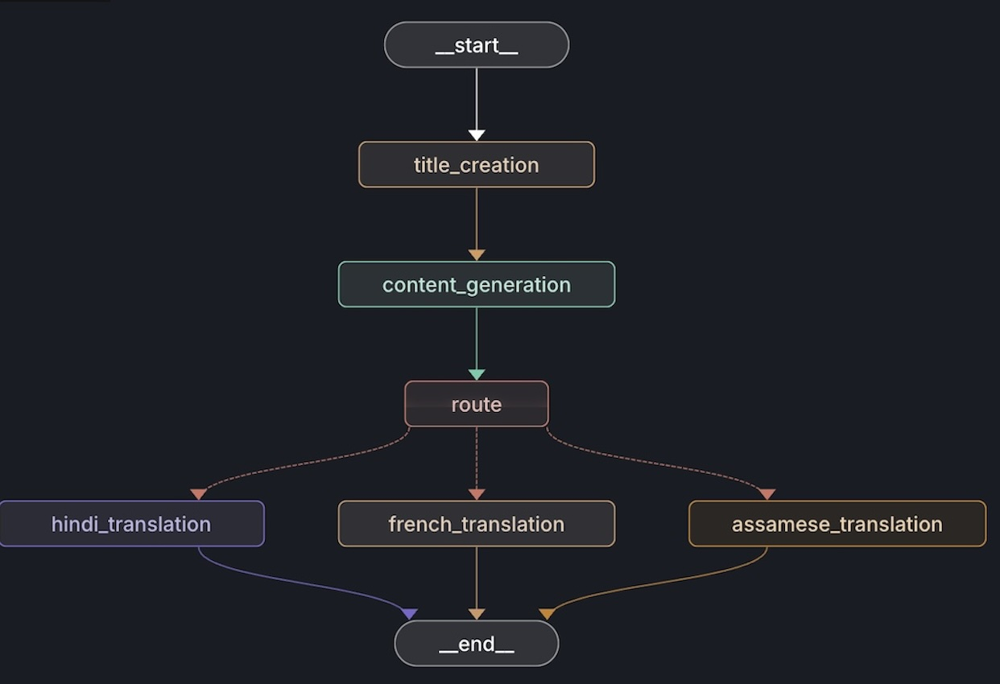
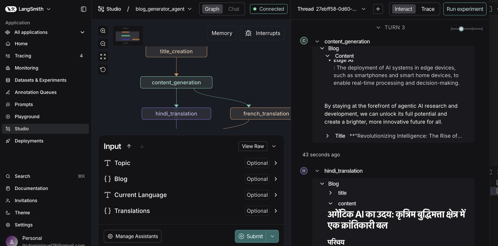
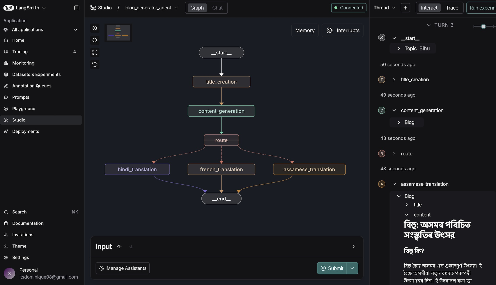
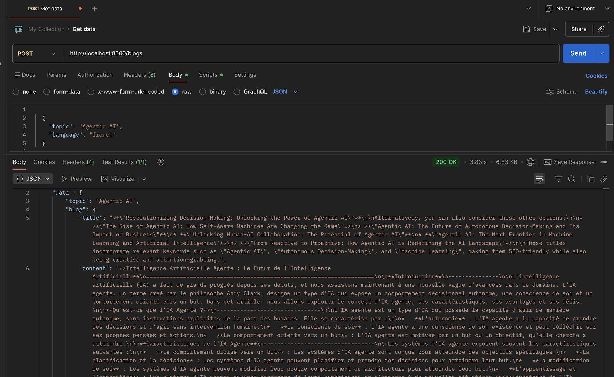

## LangGraph Blog Generator (Multilingual)

A LangGraph-powered blog generation system that creates structured blog posts and translates them into multiple languages using a router-based graph architecture, FastAPI, and LangSmith Studio.

This project demonstrates real-world agent orchestration, conditional routing, and production-style API integration.

### ✨ Features

#### 📝 Automated Blog Generation

- Title creation

- Structured content generation (Markdown)

#### 🌍 Multilingual Translation

- Hindi

- French

- Assamese
(easily extensible)

#### 🧭 Router-Based LangGraph Architecture

- Dynamic routing based on current_language

- Clean separation of generation vs translation
### 📸 Screenshots

### 🔀 LangGraph Workflow




## LangGraph Studio – Hindi



## LangGraph Studio – Assamese



## API Test (Postman)




#### 🧪 LangGraph Studio Integration

- Visual graph execution
- Node-level inspection
- Debug-friendly workflows

#### 🚀 FastAPI Backend

- POST API for blog generation

- Works with Postman / frontend clients

### 🏗️ Architecture Overview
High-Level Flow
```
Start
  ↓
Title Creation
  ↓
Content Generation
  ↓
Language Router
  ├── Hindi Translation
  ├── French Translation
  ├── Assamese Translation
  ↓
End
```

flowchart TD

    A[Start] --> B[Title Creation]
    B --> C[Content Generation]
    C --> D{Language Router}

    D -->|Hindi| E[Hindi Translation]
    D -->|French| F[French Translation]
    D -->|Assamese| G[Assamese Translation]

    E --> H[End]
    F --> H
    G --> H

#### Why This Design?

- Separation of concerns

- Writing ≠ Translation

- Scalable routing

- Each language is an independent node

- Production-friendly

- Same graph works via API and Studio

### 🧩 Project Structure
```
blogger-agent/
│
├── src/
│   ├── graphs/
│   │   └── graph_builder.py      # LangGraph construction & routing
│   │
│   ├── nodes/
│   │   └── blog_node.py          # Title, content, translation logic
│   │
│   ├── states/
│   │   └── blogstate.py          # Typed blog state schema
│   │
│   └── llms/
│       └── groqllm.py            # LLM wrapper (Groq)
│
├── app.py                        # FastAPI entry point
├── langgraph.json                # LangGraph Studio config
├── request.json                  # Sample Studio input
├── requirements.txt
├── README.md
└── .env (ignored)
```
### LangGraph Design
Nodes

- title_creation

- content_generation

- hindi_translation

- french_translation

- assamese_translation

#### Router Logic

Routing is decided based on:
```
state["current_language"]
```

Example:

- "hindi" → hindi_translation

- "french" → french_translation

- "assamese" → assamese_translation

### 🧪 LangGraph Studio (Visual Debugging)

Start Studio:
```
langgraph dev
```

Then open the Studio URL shown in terminal.

Example Studio Input
{
  "topic": "Ethical AI",
  "current_language": "french"
}

What You Can See in Studio

- Node-by-node execution

- Intermediate blog state

- Router decisions

- Final translated output


### 🚀 FastAPI Usage
```
Start the API
python app.py
```

Server runs at:
```
http://localhost:8000
```
POST /blogs
Request (Postman / curl)
```
{
  "topic": "Ethical AI",
  "current_language": "hindi"
}
```
Response
```
{
  "data": {
    "blog": {
      "title": "...",
      "content": "..."
    }
  }
}
```
#### 🔐 Environment Variables

Create a .env file (never commit this):
```
LANGCHAIN_API_KEY=your_key_here
GROQ_API_KEY=your_key_here
```
### 🛠️ Tech Stack

- Python 3.13

- LangGraph

- LangChain

- LangSmith Studio

- FastAPI

- Groq LLM

- Pydantic

- Uvicorn

#### 🌱 Future Enhancements

- Dynamic language registration
-  Auto language detection
-  Frontend UI
- Streaming responses
- Unit & graph tests
-  Cloud deployment


