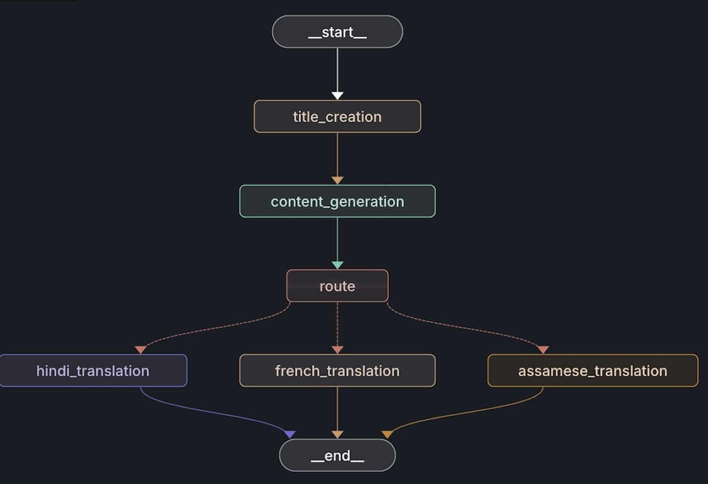
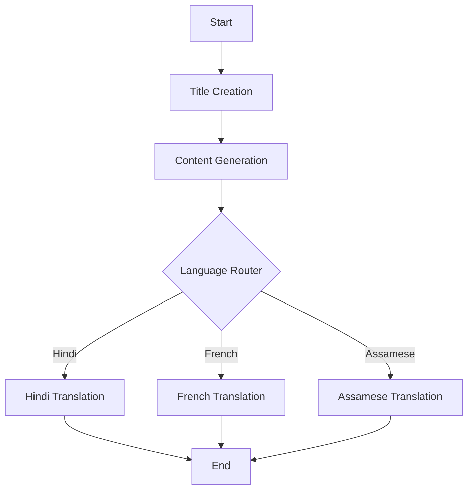
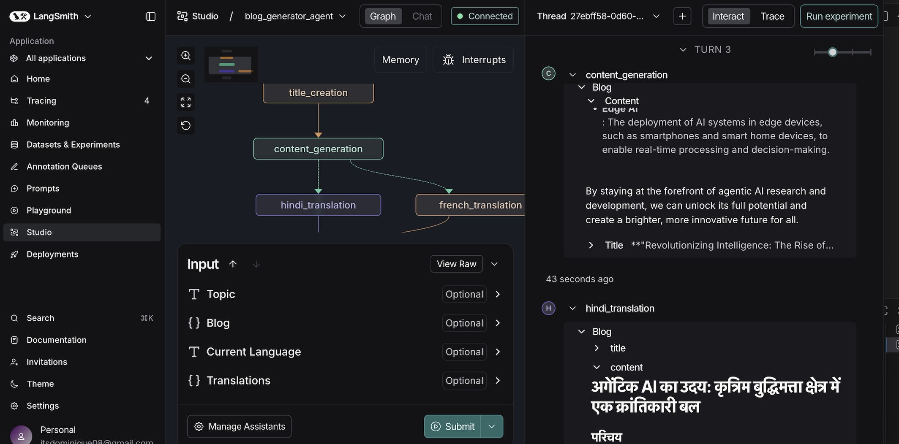
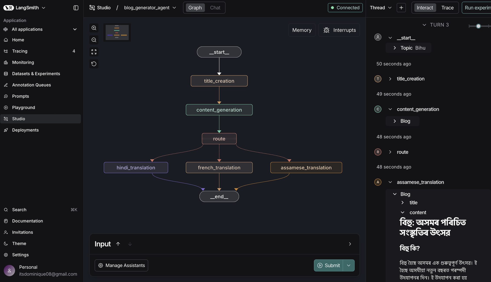
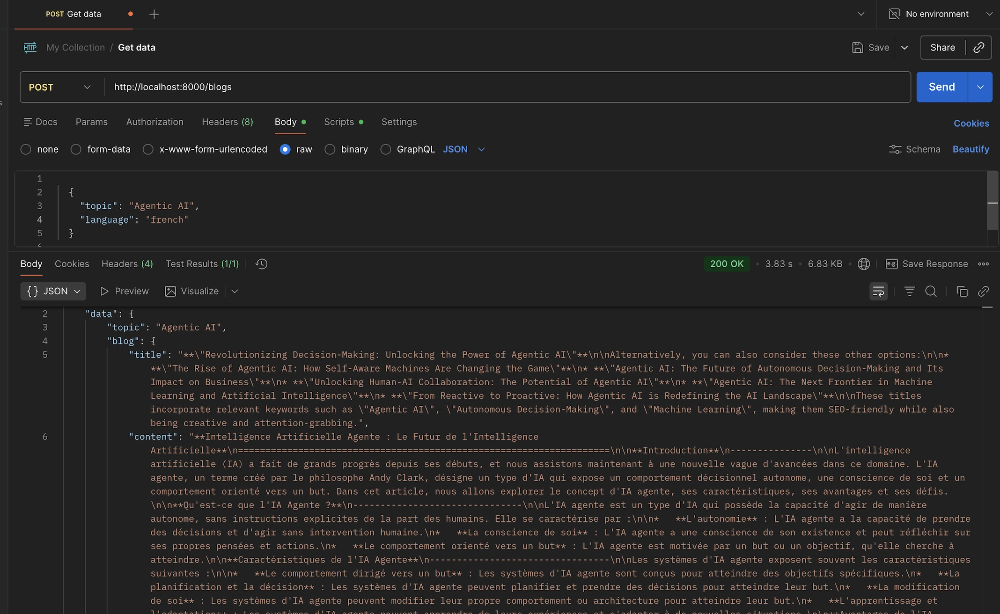

<div align="center">

# Blogger Agent (LangGraph)

### Your Multilingual AI Blog Generation Assistant


*Generate blog titles and content, then route to language-specific translation nodes with LangGraph.*

[Overview](#overview) • [Architecture](#architecture) • [Installation](#installation) • [API Usage](#api-usage) • [Project Structure](#project-structure)

</div>

---

## Overview

**Blogger Agent** is a router-based LangGraph application that creates a complete blog post from a topic and optionally translates it into supported languages.

| Blog Generation | Router Logic | Translation Nodes | API Integration |
|---|---|---|---|
| Title + markdown content generation | Conditional language routing | Hindi, French, Assamese | FastAPI `POST /blogs` |

---

## What Makes It Useful?

```text
Topic Input -> Title Creation -> Content Generation -> Language Router -> Translated Blog Output
```

### Supported Language Paths

| Input `current_language` | Routed Node |
|---|---|
| `hindi` | `hindi_translation` |
| `french` | `french_translation` |
| `assamese` | `assamese_translation` |

---

## Installation

### Prerequisites

| Required | Optional |
|---|---|
| Python 3.13+ | LangSmith account |
| `uv` or `pip` | Postman |
| Groq API key | LangGraph Studio |

### Local Setup

<details>
<summary><b>Step 1: Clone Repository</b></summary>

```bash
git clone https://github.com/sandhya-bdb/blogger-agent-langgraph.git
cd blogger-agent-langgraph
```

</details>

<details>
<summary><b>Step 2: Install Dependencies</b></summary>

Using `uv`:

```bash
uv sync
```

Or using `pip`:

```bash
pip install -r requirements.txt
```

</details>

<details>
<summary><b>Step 3: Configure Environment</b></summary>

Create a `.env` file in the root:

```env
GROQ_API_KEY=your_groq_api_key
LANGCHAIN_API_KEY=your_langsmith_api_key
```

</details>

<details>
<summary><b>Step 4: Run API Server</b></summary>

```bash
python app.py
```

Server starts at `http://localhost:8000`

</details>

---

## Architecture

### System Architecture & Flow



### Graph Components

| Layer | Components |
|---|---|
| Generation | `title_creation`, `content_generation` |
| Routing | `route` + `route_decision` based on `current_language` |
| Translation | `hindi_translation`, `french_translation`, `assamese_translation` |
| Serving | FastAPI app in `app.py` |
| LLM | Groq `llama-3.1-8b-instant` |

### High-Level Graph


```mermaid
flowchart TD
    A["Start"] --> B["Title Creation"]
    B --> C["Content Generation"]
    C --> D{"Language Router"}

    D -->|Hindi| E["Hindi Translation"]
    D -->|French| F["French Translation"]
    D -->|Assamese| G["Assamese Translation"]

    E --> H["End"]
    F --> H
    G --> H
```

---

## Features

| Core Capability | Details |
|---|---|
| Automated Blog Generation | Topic -> SEO-style title -> structured markdown content |
| Multilingual Output | Routes to language-specific translation node |
| Graph-Native Orchestration | Clear node boundaries and conditional edges |
| API-First Design | Exposed as FastAPI endpoint |
| Studio Debugging | Compatible with LangGraph Studio for visual inspection |

---

## Tech Stack

| AI & Workflow | Backend & Runtime |
|---|---|
| LangGraph | FastAPI |
| LangChain | Uvicorn |
| LangChain Groq | Python 3.13+ |
| LangGraph CLI | Pydantic |

---

## API Usage

### Endpoint

| Method | Route | Description |
|---|---|---|
| `POST` | `/blogs` | Generate and optionally translate a blog |

### Sample Request

```bash
curl -X POST http://localhost:8000/blogs \
  -H "Content-Type: application/json" \
  -d '{"topic":"Ethical AI","current_language":"french"}'
```

### Sample JSON Body

```json
{
  "topic": "Ethical AI",
  "current_language": "hindi"
}
```

### Sample Response Shape

```json
{
  "data": {
    "topic": "Ethical AI",
    "current_language": "hindi",
    "blog": {
      "title": "...",
      "content": "..."
    }
  }
}
```

---

## LangGraph Studio

Run Studio locally:

```bash
langgraph dev
```

Use `request.json` as a quick input payload.

---

## Project Structure

```text
.
├── app.py                          # FastAPI server entrypoint
├── langgraph.json                  # Studio config
├── request.json                    # Sample request payload
├── src/
│   ├── graphs/
│   │   └── graph_builder.py        # Graph construction and routing
│   ├── nodes/
│   │   └── blog_node.py            # Blog + translation node logic
│   ├── states/
│   │   └── blogstate.py            # State schema
│   └── llms/
│       └── groqllm.py              # Groq LLM wrapper
├── screenshots/
│   ├── flow.png
│   ├── langgraph_studio_assamese.png
│   ├── langgraph_studio_hindi.png
│   └── postman_french.png
├── pyproject.toml
├── requirements.txt
└── README.md
```

---

## Screenshots

| Graph Flow | Studio (Hindi) |
|---|---|
|  |  |

| Studio (Assamese) | Postman (French) |
|---|---|
|  |  |

---

## Future Improvements

- Add dynamic language registration.
- Add automatic language detection from user input.
- Add streaming responses for long content generation.
- Add unit tests and graph-level integration tests.
- Add deployment setup for cloud environments.

---

## Author

**Sandhya Banti Dutta Borah**  
LangGraph-based multilingual blog generation project for practical agent orchestration and API deployment.
